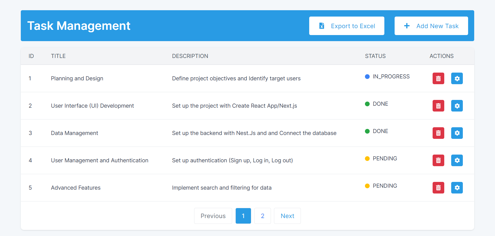

# Task Management App

This project is a Task Management Application, developed using NestJS for the backend, Next.js for the frontend, and PostgreSQL for the database. The application allows users to create, read, update, and delete tasks, with each task having a title, description, and status.

## Project Structure

- `backend`: Contains the NestJS backend application
- `frontend`: Contains the Next.js frontend application
- `dockerfiles`: Docker configurations for the project
- `pictures`: Images and other static assets
- `postgres_data`: PostgreSQL data directory
- `docker-compose.yml`: Docker Compose configuration file
